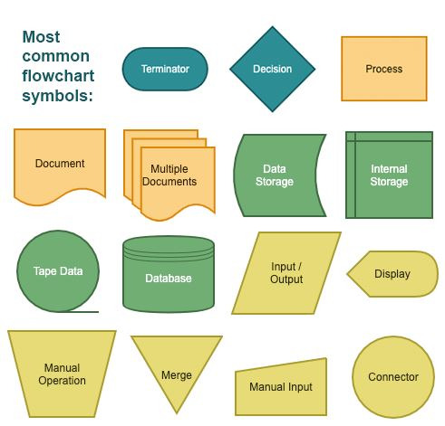
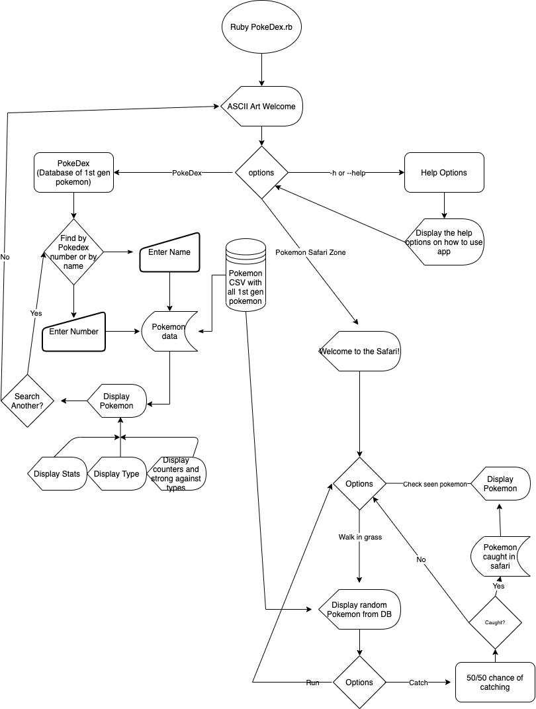

### dependencies required by the application to operate

##### Hardware

Hardware limitations are none, this application has been tested both on Mac OS and Windo OS, have not been able to test Linux but should be no issue. All Ruby Gems are highly tested in all OS and program is small enough that no hardware issues should come up.

##### Software

Not installed by program

- Ruby


Installed by program(Gems)

- gem 'rspec', '~> 3.9'

- gem 'colorize', '~> 0.8.1'

- gem 'smarter_csv', '~> 1.2', '>= 1.2.6'

- gem 'tty-prompt', '~> 0.22.0'

- gem 'tty-table', '~> 0.12.0'

- gem 'rubocop', '~> 0.42.0'


### How to install application 

option 1 - you are just wanting to clone the application below is the Git Command.
```
 Git clone https://github.com/Tye-Hadfield/Pokedex_with_PokeSafari.git
```

option 2 - Run app in current folder and display application in terminal.

```
Git clone https://github.com/Tye-Hadfield/Pokedex_with_PokeSafari.git
cd Pokedex_with_PokeSafari/src
./run_app.sh
```
option 3 - Instal folder on Desktop and run app in termnial.

``` 
cd ~
cd Desktop
Git clone https://github.com/Tye-Hadfield/Pokedex_with_PokeSafari.git
cd Pokedex_with_PokeSafari/src
./run_app.sh
```

option 4 - Clone folder and open in VS code

```
Git clone https://github.com/Tye-Hadfield/Pokedex_with_PokeSafari.git
cd Pokedex_with_PokeSafari/src
code .

```


You must include:
- any dependencies required by the application to operate
- any system/hardware requirements
- 
- 
- 
# Source Control

https://github.com/Tye-Hadfield/Pokedex_with_PokeSafari.git

<br>


# Software Development Plan 


### describe at a high level what the application will do

The Pokedex and Pokemon Safari is a terminal application to search through the 1st Gen Pokemon with a choice to allow you to see their types which includes their weaknesses and strengths for both attack and defence, this will display dual types if the Pokemon is a dual type Pokemon. Within this is application you will be able to search the Pokedex via the Pokemon’s Pokedex number or via the Pokemon’s name. A Pokemon Safari mini game has also been included which allows the user to run through the grass and any of the 1st Gen Pokemon may appear, you will then be allowed to catch or run away from the Pokemon that has appeared. The safari has an option that allows you to check your caught Pokemon within the current session. 


### identify the problem it will solve and explain why you are developing it

This application was created to be able to identify your favourite 1st Gen Pokemon via the Pokedex and while then being able to see the type chart that allows you to have an edge when battle against this Pokemon or battling with this Pokemon. The Safari was a mini game to capture what types of Pokemon you can run into within the 1st Gen games and also give ideas to search them via the Pokedex. 


### identify the target audience

The target audience for this application is those who enjoy Pokemon and are able to understand when battling Pokemon you need to understand a lot about the Pokemon’s types and stats which have all been included in this application. The Pokemon Safari was target as a fun mini game for those who enjoy the Pokemon fandom especially the 1st Gen, in the safari all the 1st Gen Pokemon appear and are then able to be captured and shown. 


### explain how a member of the target audience will use it

The target audience may use this application along side playing the early Pokemon games, in the new age Pokemon games we are shown if our attacks are effective against our opposing Pokemon but back in the earlier generations we had to remember what was effective against what. The audience may find fun in the Pokemon Safari with all the random Pokemon that may appear and can really spring excitement if there potential favourite Pokemon appears!


# List of features 


### Pokedex

The Pokedex feature was created to help the Pokemon players search a database (CSV file) for their favourite Pokemon via name or pokedex number, each the search options have their own methods inside a searching class. Both the search methods include a loop that allows the user to search for another Pokemon via their selected method of choice with a simple yes or no question that is displayed using TTY prompt. Errors within this feature are handled and will display a pop-up notification on what you may be doing wrong, for example if you chose a number higher that 151 you will get a message that displays you number is higher than what is being asked and if you are searching for a name incorrectly you will also be prompted with a pop-up that it is incorrect spelling, nil input has also been factored into the application that will not error the application out.

### Type Chart

Type chart is an effective and powerful tool when used for Pokemon battling, for those who are unaware of Pokemon you have a ‘creature’ also known as a Pokemon and this Pokemon has a type for example the Pokemon Mew is a psychic type Pokemon and this means that Mew will have weaknesses and strengths. The Type chart feature was created to be able to display the Pokemon’s strengths and weaknesses you have searched via the Pokedex, this is presented to the user after find their Pokemon in a question with a y or no input required which is displayed via tty prompt. The types data is imported from a CSV file which includes the headers to be able to pull the correct types needed, the conditional control structure allows the user to no display the type chart if they wish which would move them to the next part of the method.   

### Pokemon Safari

The Pokemon Safari is a fun mini game that allows a user to walk through grass and a random 1st Gen Pokemon appears. The Pokemon Safari has had a class that has been created and called upon in the main code, we are pulling from the same CSV database as the Pokedex which is broken down into a name that will get pushed into an array if the Pokemon is caught. The loop in the safari allows the user to catch as many Pokemon they wish while everyone caught is pushed into an array which the user can call to see the Pokemon they have caught. TTY prompt is used for control flow throughout the Safari minimising user error and error handling issues. The three contestant questions asked to the user are Run,Catch,Menu and Check these are all within a loop that allows the user to cycle through the feature and exit when they wish. Since this feature is all handled through TTY prompt their is no user input like the Pokedex meaning error handling for user input is un-needed.
 


# Develop an outline of the user interaction and experience for the application.

When first entering the Pokedex / Safari application you will be greeted with a heading and four options, these include Pokedex, Safari, Help and exit. The Pokedex option will link you through to the Pokedex search options that allow the user to select whether they want to search via name or number, once the user chooses they will have to enter there respective input they choose. If a user choose to user a number but does not stick within the asked range 1-151 they will have an error pop up for 2 seconds that will instruct them of their wrong input. Name also has error handling to state that you can not enter nothing or incorrectly spell the name of the Pokemon. Once the user has landed on their pokemon they will be asked if they wish to see the type chart for this Pokemon they can choose Yes/No which is brought up via TTY prompt if selecting yes the type(s) for this Pokemon will appear. A search again option appears allowing the user to search again or select no which take them back to the main menu. If Safari is selected the user will be taken to a screen where they begin their journey, right away you are presented with a pokemon and four choices Run,Catch,Menu and check. Run is a function that will just search for another Pokemon, Catch will allow you to attempt to catch the Pokemon with 50/50 odds, Menu will return you to main menu and Check is a way for the user to check their currently caught Pokemon. At the main menu you are presented with a help option to explain further help on the features along with some Command line arguments you can use.


# Develop a diagram which describes the control flow of your application. Your diagram must:

<br>



<br>




# Develop an implementation plan :


### Trello board

https://trello.com/b/diJbf3s4/poke-dex-terminal-app


